# Generate-and-scan-QrCode-using-zxing-library

Here zxing library is used for scanning and generating QR code

## Dependency

in `build-gradle` app we add

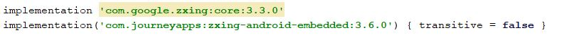

and `manifests` we need to add `Camera` permission for scanning the QR code

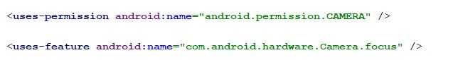

and for material design of `edittext` we add material design dependency

## Getting Started

Here we add two buttons, one for generating QR code using our own number and one is for scanning QR code

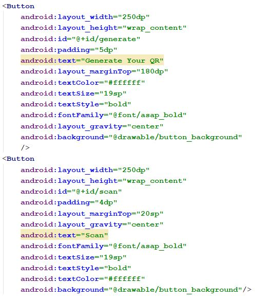

### Generate your QR

when we click generate button a new layout appeared where we need to add your phone number to create your own QR code

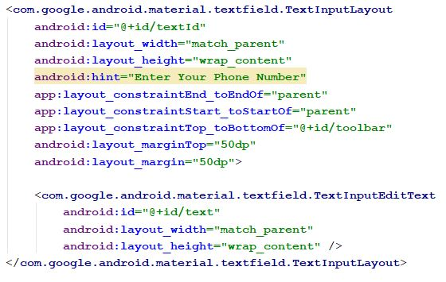

after adding phone number and clicking generate button we can genrate our QR code

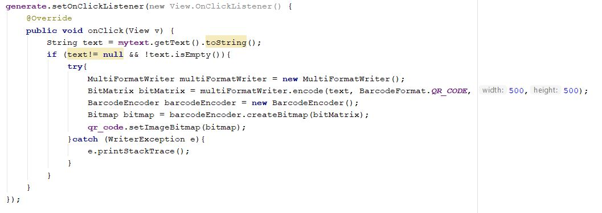

### Scan QR code

when we click scanning button our camera intent will activat and camera opened with a text `scanning`

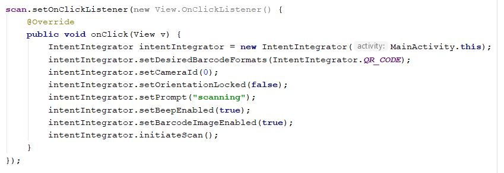

after scannig the QR code the result of the QR code will appeared in a Box with the result and `Copy` and `Cancel` buttons

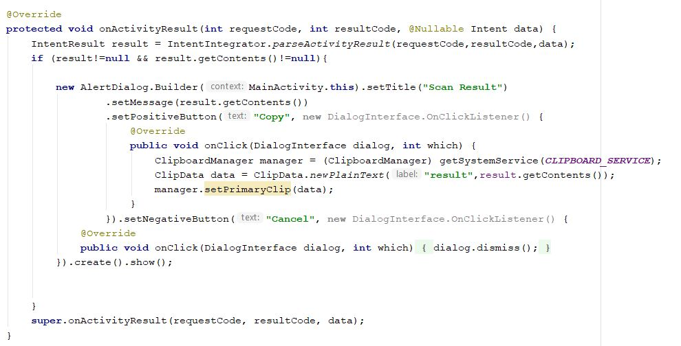

# ScreenShots

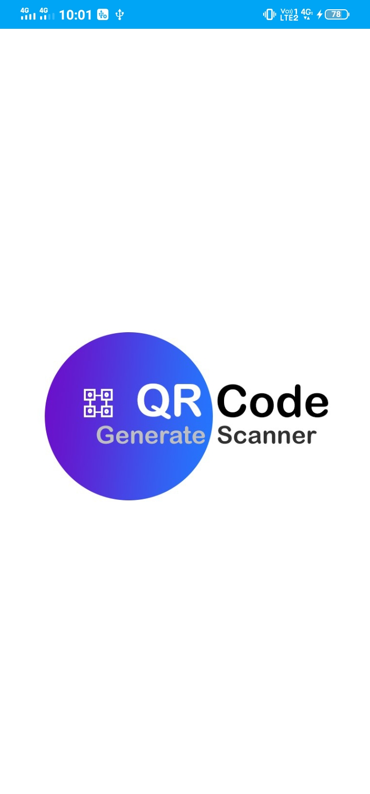 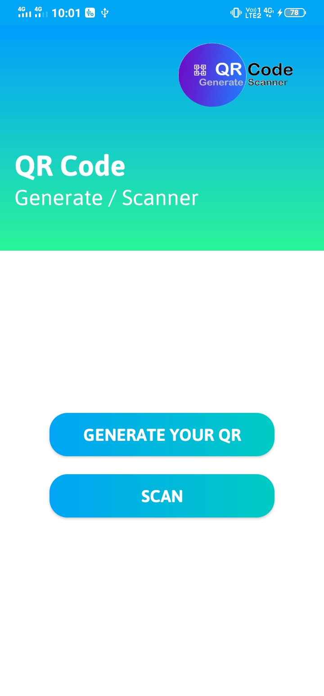 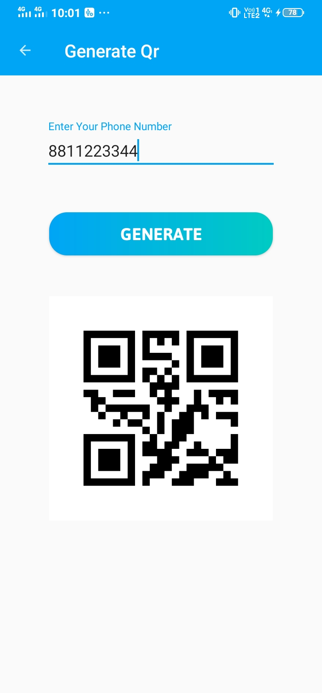 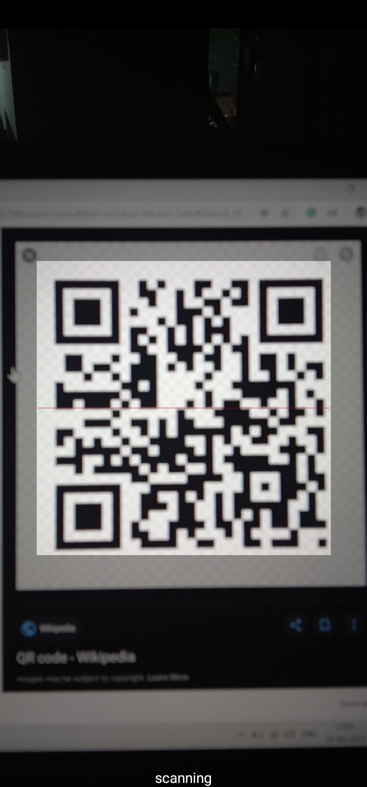  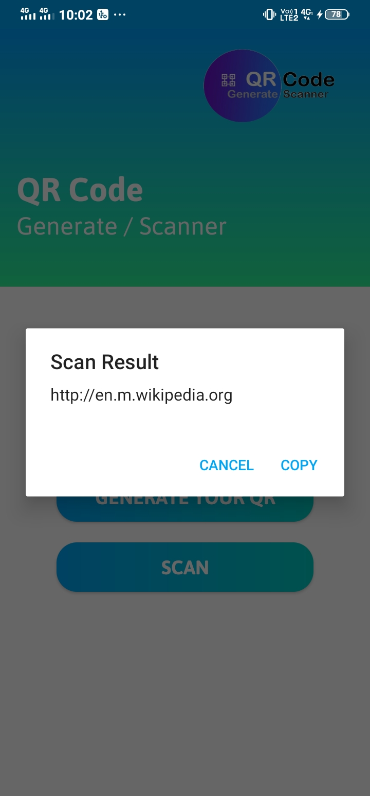 

